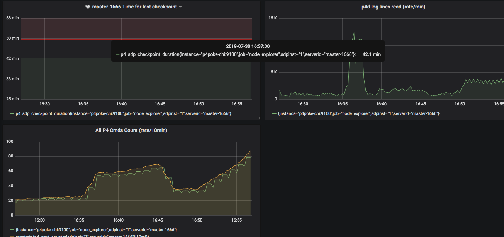
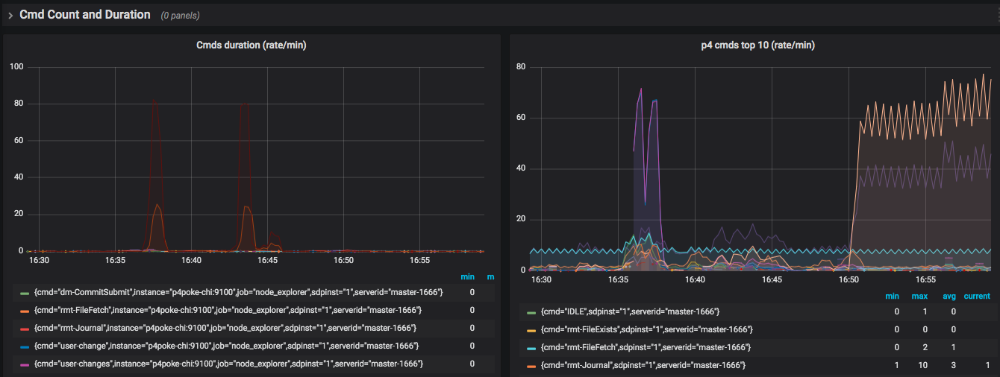
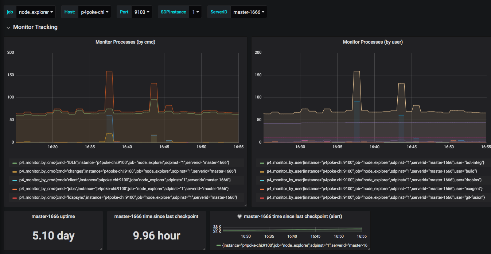
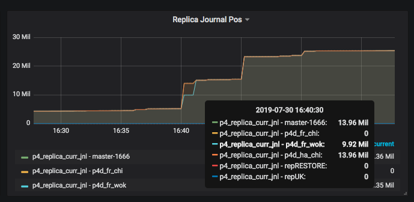
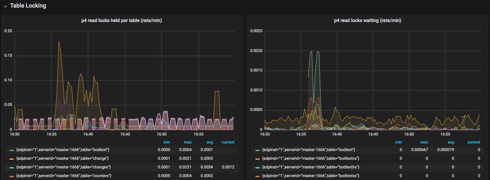

# p4prometheus

Utility which integrates Perforce (Helix Core) with Prometheus. If performs real-time analysis of p4d log files feeding to a dashboard and for system alerting.

It continuously parses p4d log files and writes a summary to 
a specified Prometheus compatible metrics file which can be handled via the `node_exporter`
textfile collector module.

Uses [go-libp4dlog](https://github.com/rcowham/go-libp4dlog) for actual log file parsing.

- [p4prometheus](#p4prometheus)
  - [Support Status](#support-status)
  - [Overview](#overview)
- [Grafana Dashboards](#grafana-dashboards)
- [Detailed Installation](#detailed-installation)
- [Metrics Available](#metrics-available)
  - [P4Prometheus](#p4prometheus-1)
  - [Monitor_metrics.sh](#monitor_metricssh)
  - [Locks](#locks)

## Support Status

This is currently a Community Supported Perforce tool.

## Overview

This is part of a solution consisting of the following components:

* Prometheus - time series metrics management system: https://prometheus.io/
* VictoriaMetrics - (optional) high performing storage management which is Prometheus compatible: https://github.com/VictoriaMetrics/VictoriaMetrics
* Grafana - The leading open source software for time series analytics - https://grafana.com/
* node_exporter - Prometheus collector for basic Linux metrics - https://github.com/prometheus/node_exporter

Two custom components:

* p4prometheus - This component.
* monitor_metrics.sh - [SDP](https://swarm.workshop.perforce.com/projects/perforce-software-sdp) compatible bash script to generate simple supplementary metrics - [monitor_metrics.sh](demo/monitor_metrics.sh)

Check out the 
The custom components referred to above are "Prometheus targets".

# Grafana Dashboards

When installed and setup, you can get dashboards such as the following:

Commands Summary:

Rates for command durations and count:

Active commands (monitor):

Replication status:

Read/write locks held/waiting status:

Dashboard alerts can be defined, as well as alert rules which are actioned by [alertmanager](https://prometheus.io/docs/alerting/alertmanager/) - see installation link below for examples.

# Detailed Installation

You need to install Prometheus and Grafana using standard methods. This is typically done on a seperate VM/machine to the Perforce server itself (for security and HA reasons).

Note that all the components do run on Windows but you will need an appropriate Service wrapper.

See [Detailed Installation Instructions (INSTALL.md)](INSTALL.md) in this project.

# Metrics Available

## P4Prometheus

The basic metrics are those implemented in [P4D Log Parsing library](https://github.com/rcowham/go-libp4dlog) which it calls.

| Metric Name | Description |
| --- | ----------- |
| p4_prom_log_lines_read | A count of log lines read - useful to make sure p4prometheus is working as expected |
| p4_prom_cmds_processed | A count of all cmds processed - a key metric to show as a rate |
| p4_prom_cmds_pending | A count of all current cmds (not completed) - too high a value indicates issues with log commands |
| p4_cmd_running | The number of running commands at any one time - a high value indicates concurrent jobs and/or locks |
| p4_prom_cpu_user | User CPU used by p4prometheus |
| p4_prom_cpu_system | System CPU used by p4prometheus |
| p4_sync_files_added | The number of files added to workspaces by syncs |
| p4_sync_files_updated | The number of files updated in workspaces by syncs |
| p4_sync_files_deleted | The number of files deleted in workspaces by syncs |
| p4_sync_bytes_added | The number of bytes added to workspaces by syncs |
| p4_sync_bytes_updated | The number of bytes updated in workspaces by syncs |
| p4_cmd_counter | A count of completed p4 cmds (by cmd) |
| p4_cmd_cumulative_seconds | The total in seconds (by cmd) |
| p4_cmd_cpu_user_cumulative_seconds | The total in user CPU seconds (by cmd) |
| p4_cmd_cpu_system_cumulative_seconds | The total in system CPU seconds (by cmd) |
| p4_cmd_error_counter | A count of cmd errors (by cmd) |
| p4_cmd_user_counter | A count of completed p4 cmds (by user) |
| p4_cmd_user_cumulative_seconds | The total in seconds (by user) |
| p4_cmd_ip_counter | A count of completed p4 cmds (by IP) - can be turned off for large sites |
| p4_cmd_ip_cumulative_seconds | The total in seconds (by IP) - can be turned off for large sites |
| p4_cmd_user_detail_counter | A count of completed p4 cmds (by user and cmd) - can be turned off for large sites or specify only named automation users |
| p4_cmd_user_detail_cumulative_seconds | The total in seconds (by user and cmd) - as above |
| p4_cmd_replica_counter | A count of completed p4 cmds (by broker/replica/proxy) |
| p4_cmd_replica_cumulative_seconds | The total in seconds (by broker/replica/proxy) |
| p4_cmd_program_counter | A count of completed p4 cmds (by program) - identifies program/app versions, e.g. p4 or p4v or API |
| p4_cmd_program_cumulative_seconds | The total in seconds (by program) |
| p4_total_read_wait_seconds | The total waiting for read locks in seconds (by table) |
| p4_total_read_held_seconds | The total read locks held in seconds (by table) |
| p4_total_write_wait_seconds | The total waiting for write locks in seconds (by table) |
| p4_total_write_held_seconds | The total write locks held in seconds (by table) |
| p4_total_trigger_lapse_seconds | The total lapse time for triggers in seconds (by trigger) |

## Monitor_metrics.sh

| p4_server_uptime | P4D Server uptime (seconds) |
| p4_change_counter | P4D change counter - monitor normal activity for submits etc |
| p4_monitor_by_cmd | P4 running processes - counted by cmd |
| p4_monitor_by_user | P4 running processes - counted by user |
| p4_process_count | P4 running processes - counted via 'ps' |
| p4_completed_cmds | Completed p4 commands - simple grep of log file (turned off for large logs) |
| p4_sdp_checkpoint_log_time | Time of last checkpoint log - helps check if automated jobs are running |
| p4_sdp_checkpoint_duration | Time taken for last checkpoint/restore action - check for sudden increases |
| p4_replica_curr_jnl | Current journal for server |
| p4_replica_curr_pos | Current journal for server - key measure of replication lag |
| p4_error_count | Server errors by id - for sudden spurts of errors |
| p4_pull_errors | P4 pull transfers failed count - to monitor replication status |
| p4_pull_queue | P4 pull files in queue count - for replication |

## Locks

This is only available on Linux and requires the `lslocks` utility to be installed.

These are generated by `monitor_wrapper.sh` which calls `monitor_metrics.py`.
