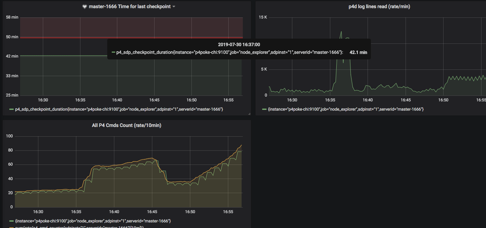
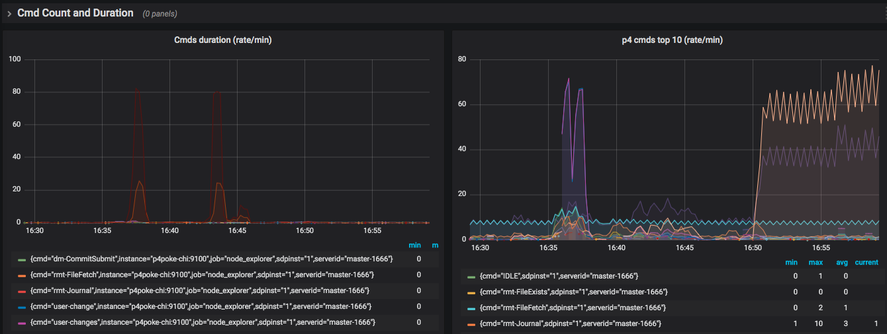
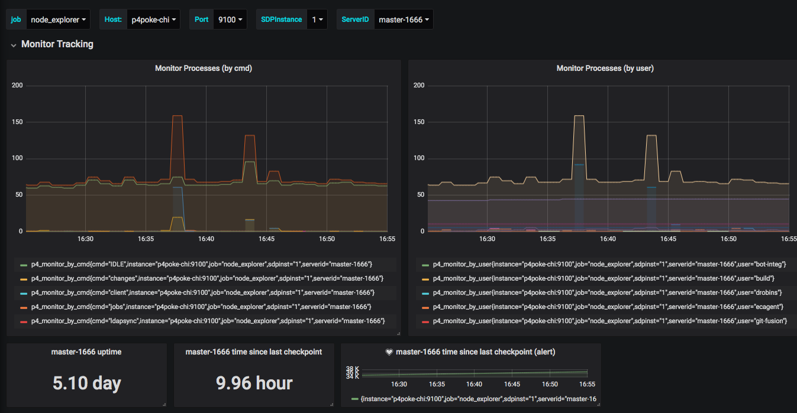
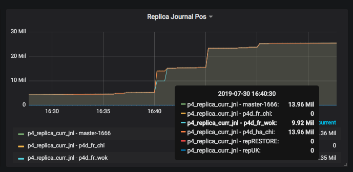
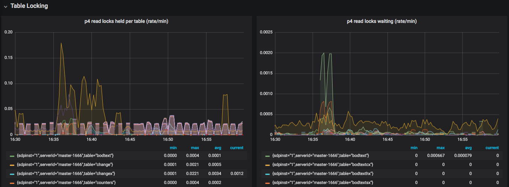

= Perforce P4Prometheus - Overview
Perforce Professional Services <consulting@perforce.com>
:revnumber: v2026.1
:revdate: 2026-09-15
:doctype: book
:icons: font
:toc:
:toclevels: 5
:sectnumlevels: 4
:xrefstyle: full

image:https://img.shields.io/badge/Support-Community-yellow.svg[Support]

== Preface

P4Prometheus integrates Perforce Helix Core Server (`p4d`) with https://prometheus.io/[Prometheus] and related monitoring tools. It collects real-time metrics from `p4d` logs, `p4 monitor`, and related sources, then exposes them for Prometheus collection and Grafana dashboards. The metrics can also drive system alerting.

The `p4prometheus` service continuously parses `p4d` logs and writes Prometheus textfile-collector metrics. Other project components interrogate `p4d` and associated logs for supplementary metrics.

:sectnums:
== Installation

Use the automated scripts for new installations and upgrades. The canonical guide is link:P4Prometheus_Installation.adoc[P4Prometheus Installation].

It covers monitoring-server, Helix Core server, and node-exporter-only installations; upgrades; dedicated data volumes; air-gapped installations; state files; and manual component installation where scripts cannot be used.

== Support Status

This is a Community Supported Perforce tool.

== Overview

P4Prometheus is part of a monitoring solution made of these components:

* https://prometheus.io/[Prometheus]: time-series metrics management.
* https://github.com/VictoriaMetrics/VictoriaMetrics[VictoriaMetrics]: optional, Prometheus-compatible long-term metrics storage.
* https://grafana.com/[Grafana]: metrics dashboards and visualization.
* https://github.com/prometheus/node_exporter[node_exporter]: Linux host metrics and textfile collection.
* https://github.com/prometheus-community/windows_exporter[windows_exporter]: Windows host metrics.
* https://github.com/prometheus/alertmanager[Alertmanager]: alert routing, grouping, and de-duplication.

Project components:

* link:../releases/latest[p4prometheus]: a released binary that parses Helix Core logs.
* link:../cmd/p4metrics/README.md[p4metrics]: supplementary Helix Core and SDP-compatible metrics.
* link:../scripts/monitor_metrics.py[monitor_metrics.py] and link:../scripts/monitor_wrapper.sh[monitor_wrapper.sh]: Linux lock monitoring using `lslocks` and `p4 monitor show`.
* link:../cmd/p4logtail/README.md[p4logtail] and link:../cmd/p4plogtail/README.md[p4plogtail]: completed-command log tails with JSON output.

P4Prometheus uses https://github.com/rcowham/go-libp4dlog[go-libp4dlog] for log parsing.

The installation and upgrade scripts support standard installation, dedicated data volumes (`-d /data`), offline assets (`--local-tarballs-dir`), SDP-safe configuration in `/p4/common/site/config/`, hostname-specific HMS fleet configuration, and stateful non-destructive upgrades. See link:P4Prometheus_Installation.adoc[the installation guide] for details.

https://prometheus.io/docs/introduction/overview/[Prometheus overview]

image:https://prometheus.io/assets/docs/architecture.svg[Prometheus architecture]

== Grafana Dashboards

When configured, Grafana dashboards provide command, replication, lock, and host-level views.

.Commands Summary

.Command Rates and Durations

.Active Commands

.Replication Status

.Read and Write Locks

Grafana dashboards can define alerts; Alertmanager processes their notifications. The installation guide includes setup and validation guidance, and link:P4_RunbookAlertHandling.adoc[Runbook Alert Handling] provides a customizable operational runbook.

== Metrics Available

All principal metrics carry `serverid` and, for SDP installations, `sdpinst` labels. The README remains the exhaustive metric-name reference: link:../README.md#metrics-available[metrics available].

=== p4prometheus Metrics

The primary log parser reports command throughput, active commands, resource use, synchronization activity, command error counts, command durations, and lock wait/held time.

[cols="1,2",options="header"]
|===
|Metric family |Examples

|Parser health and throughput
|`p4_prom_log_lines_read`, `p4_prom_cmds_processed`, `p4_prom_cmds_pending`

|Command activity
|`p4_cmd_running`, `p4_cmd_counter`, `p4_cmd_cumulative_seconds`

|Resource use
|`p4_prom_cpu_user`, `p4_prom_cpu_system`, `p4_prom_memory`

|Command dimensions
|`p4_cmd_user_counter`, `p4_cmd_ip_counter`, `p4_cmd_replica_counter`, `p4_cmd_program_counter`

|Lock timings
|`p4_total_read_wait_seconds`, `p4_total_read_held_seconds`, `p4_total_write_wait_seconds`, `p4_total_write_held_seconds`
|===

=== p4metrics Metrics

`p4metrics` replaces the legacy `monitor_metrics.sh` metrics while retaining compatible names and labels. It reports active processes, memory, server identity and uptime, replication, journal/log rotation, license state, SDP job results, Swarm status, and optional memory-limit enforcement.

[cols="1,2",options="header"]
|===
|Metric family |Examples

|Process monitoring
|`p4_monitor_by_cmd`, `p4_monitor_by_state`, `p4_monitor_by_user`, `p4_monitor_max_cmd_time`

|Memory and limits
|`p4_active_memory_by_cmd`, `p4_active_memory_by_user`, `p4_memlimit_kill_candidates`, `p4_memlimit_kills_total`

|Replication
|`p4_pull_queue_total`, `p4_pull_replica_lag`, `p4_pull_replication_error`

|Server and license
|`p4_server_uptime`, `p4_p4d_build_info`, `p4_license_expires`, `p4_licensed_user_count`

|SDP jobs and logs
|`p4_sdp_checkpoint_error`, `p4_sdp_verify_errors`, `p4_journal_size`, `p4_log_size`

|Swarm
|`p4_swarm_error`, `p4_swarm_tasks`, `p4_swarm_workers`, `p4_swarm_version`
|===

=== Lock Metrics

Linux lock monitoring requires `lslocks`. `monitor_wrapper.sh` invokes `monitor_metrics.py`, which relates operating-system locks to `p4 monitor show` results. It reports:

* `p4_locks_db_read` and `p4_locks_db_write`
* `p4_locks_cliententity_read` and `p4_locks_cliententity_write`
* `p4_locks_meta_read` and `p4_locks_meta_write`
* `p4_locks_cmds_blocked`

The detailed lock-monitoring installation and troubleshooting information is in link:P4Prometheus_Installation.adoc[P4Prometheus Installation].

== Related Tools

* link:../cmd/p4logtail/README.md[p4logtail]
* link:../cmd/p4plogtail/README.md[p4plogtail]
* link:../cmd/p4erroranalyzer/README.md[p4erroranalyzer]
* link:../cmd/logresourcepressure/[logresourcepressure]
